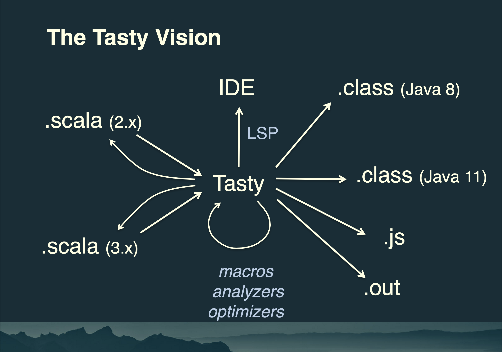

slidenumbers: true
autoscale: true
<!-- footer: A Taste of Dotty -->

# A Taste of Dotty
# <br/>

#### copyright 2021 Hermann Hueck
### https://github.com/hermannhueck/taste-of-dotty

---

# Abstract

This presentation is an introduction to Dotty / Scala 3 and an overview of many features.

It covers those features which I deem most important for Scala application developers.

For detailed information see the [Dotty documentation](https://dotty.epfl.ch/docs/index.html).

The code examples are partly my own. I also took many examples (unchanged or modified) from the Dotty Documentation.

The presentation also contains many links to specific chapters in the Dotty docs.

---

# Agenda (1/3)

- [Design Goals](#ref_design_goals)
- [Project Setup](#ref_project_setup)
- [Using Scala 2 Libraries](#ref_using_scala2_libraries)
- [TASTy](#ref_tasty)
- [Top Level _def_'s and _val_'s](#ref_top_level_defs_and_vals)
- [Indentation / Optional Braces](#ref_indentation_optional_braces)
- [New Control Syntax](#ref_new_control_syntax)
- [Main Methods](#ref_main_methods)
- [Constructor Invocations w/o _new_](#ref_constructors_without_new)
- [Traits Parameters](#ref_traits_parameters)
- [Enums and ADTs](#ref_enums_and_adts)
- [Intersection Types](#ref_intersection_types)

---

# Agenda (2/3)

- [Union Types](#ref_union_types)
- [Contextual Abstractions](#ref_contextual_abstractions)
- [Implicit Conversions](#ref_implicit_conversions)
- [Extension Methods](#ref_extension_methods)
- [Givens](#ref_givens)
- [Type Lambdas](#ref_type_lambdas)
- [Typeclasses](#ref_typeclasses)
- [Opaque Type Aliases](#ref_opaque_type_aliases)
- [Polymorphic Function Types](#ref_polymorphic_function_types)
- [Dependent Function Types](#ref_dependent_function_types)
- [Context Functions](#ref_context_functions)
- [Tuples are HLists](#ref_tuples_are_hlists)

---

# Agenda (3/3)

- [Match Types](#ref_match_types)
- [Export Clauses](#ref_export_clauses)
- [Explicit Nulls](#ref_explicit_nulls)
- [_inline_](#ref_inline)
- [Multiversial or Strict Equality](#ref_multiversial_equality)
- [Typeclass Derivation](#ref_typeclass_derivation)
- [Given By-Name Parameters](#ref_given_byname_parameters)
- [Implicit Resolution](#ref_implicit_resolution)
- [Overload Resolution](#ref_overload_resolution)
- [Other Features](#ref_other_features)
- [Resources](#ref_resources)

---

<a name="ref_design_goals"/>

# Design Goals[^1]

[^1]: [https://dotty.epfl.ch/docs/index.html](https://dotty.epfl.ch/docs/index.html)

---

### Design Goals
<br/>

- build on strong foundations (DOT Calculus)
- improve language consistency,
- eliminate surprising behaviours, puzzlers
- better (type) safety and ergonomics, simplify where possible
- improve performance

---

<a name="ref_project_setup"/>

# Project Setup[^2]

[^2]: [https://dotty.epfl.ch/docs/usage/getting-started.html](https://dotty.epfl.ch/docs/usage/getting-started.html)

---

### IDE Support[^3]
<br/>

- IntelliJ IDEA supports Scala 3.
- Metals supports Scala 3.
- Metals works with any editor that supports LSP. (Language Server Protocol)

[^3]: [https://dotty.epfl.ch/docs/usage/ide-support.html](https://dotty.epfl.ch/docs/usage/ide-support.html)

---

### sbt support
<br/>

- _sbt 1.5.x++_ supports Scala 3 out of the box.
- _sbt-dotty_ plugin is no longer needed since _sbt 1.5.0_.

---

### New _sbt_ Project
<br/>

- create new project: _sbt new scala/scala3.g8_
- (or: _sbt new scala/scala3-cross.g8_ for a cross-build project)
- _cd_ to project directory
- start _sbt_ in the project directory
- open project in _VS Code_

---

### build.sbt

```scala
val scala3Version = "3.0.0-RC3"

lazy val root = project
  .in(file("."))
  .settings(
    name := "scala3-simple",
    version := "0.1.0",
    scalaVersion := scala3Version,
    libraryDependencies += "com.novocode" % "junit-interface" % "0.11" % "test"
  )
```

---

<br/>
### project/build.properties

<br/>

```scala
sbt.version=1.5.0
```

---

<a name="ref_using_scala2_libraries"/>

# Using Scala 2 Libraries[^4]

[^4]: [https://scalacenter.github.io/scala-3-migration-guide/docs/compatibility/classpath.html](https://scalacenter.github.io/scala-3-migration-guide/docs/compatibility/classpath.html)

---

### Using Scala 2 Libraries in Scala 3

- Dotty can already utilize Scala 2 libraries.
- This works because Dotty is currently retro-compatible with Scala 2.x.
- This allows to migrate your app to Dotty, even before 3rd party dependencies have been migrated.

<br/>

```scala
// build.sbt

libraryDependencies += ("my.domain" %% "myScala3Lib" % myScala3LibVersion).cross(CrossVersion.for3Use2_13)

libraryDependencies ++= Seq(
    "co.fs2" %% "fs2-core" % fs2Version,
    "co.fs2" %% "fs2-io" % fs2Version,
    "org.scalatest" %% "scalatest" % scalaTestVersion % Test
  ).map(module => module.cross(CrossVersion.for3Use2_13))
```

---

### Using Scala 3 Libraries in Scala 2

- Scala 2.13.5 and higher can utilize Scala 3 libraries.
- This works because the Scala 3 compiler implements a TASTY reader (enabled by compiler flag _-Ytasty-reader_).

<br/>

```scala
// build.sbt

scalaVersion = "2.13.5"

scalacOptions += "-Ytasty-reader" // supported by Scala 2.13.5 and hgigher

libraryDependencies += "my.domain" %% "myScala3Lib" % myScala3LibVersion
```

---

<a name="ref_tasty"/>

# TASTy[^4a]

[^4a]: [https://www.scala-lang.org/blog/2018/04/30/in-a-nutshell.html](https://www.scala-lang.org/blog/2018/04/30/in-a-nutshell.html)

---

### What is TASTy? - (Typed Abstract Syntax Trees)

- Tasty is the high-level interchange (serialization) format for Scala 3.
- Represents the syntactic structure of programs and also contains complete information about types and positions.
- The Tasty “snapshot” of a code file is taken after type checking (so that all types are present and all implicits are elaborated) but before any transformations (so that no information is lost or changed).
- Heavily optimized for compactness (approximately same size as class files).
- .tasty files are now co-located with .class files.
- .tasty files are included in published JARs.

---



Image taken from ["Preparing for Scala 3" - Martin Odersky's keynote of Scala Days 2018, Berlin](https://de.slideshare.net/Odersky/preparing-for-scala-3)

---

<a name="ref_top_level_defs_and_vals"/>

# Top Level _def_'s and _val_'s[^5]

[^5]: [https://dotty.epfl.ch/docs/reference/dropped-features/package-objects.html](https://dotty.epfl.ch/docs/reference/dropped-features/package-objects.html)

---

### Top Level _def_'s and _val_'s

- Scala 2: _def_'s and _val_'s must be defined in a _trait_, _class_ or _object_.
- Scala 3: _def_'s and _val_'s can be defined at the top level.
<br/>
- Scala 2: To provide _def_'s and _val_'s directly in a package, one has to use package objects.
- Scala 3: Package objects are still available in 3.0, but will be deprecated and removed in 3.1 or 3.2.

---

```scala
// whatever.scala
package dotty.samples

import scala.util.chaining.*

val r = scala.util.Random

def randomInt(): Int =
  r.nextInt

def boxed(what: String): String = {
  val line = "\u2500" * 50
  s"$line\n${what.toString}\n$line"
}

def printBoxed(what: String): Unit =
  what pipe boxed tap println
```

---

<a name="ref_indentation_optional_braces"/>

# Indentation / Optional Braces[^6]

[^6]: [https://dotty.epfl.ch/docs/reference/other-new-features/indentation.html](https://dotty.epfl.ch/docs/reference/other-new-features/indentation.html)

---

### Indentation / Optional Braces
<br/>

- Braces are optional.
- Without braces identation becomes significant to delimit a block of code.
- An colon at the end of the line starts a new indentation block.
- _end_ markers are optional.

---

- with braces:

```scala
// Scala 2 + 3:
trait MyTrait {
  def boxed(what: Any): String = {
    val line = "\u2500" * 50
    s"$line\n${what.toString}\n$line"
  }
}
```

- without braces:

```scala
// Scala 3:
trait MyTrait:
  def boxed(what: Any): String =
    val line = "\u2500" * 50
    s"$line\n${what.toString}\n$line"
end MyTrait // optional end marker
```

---

<a name="ref_new_control_syntax"/>

# New Control Syntax[^7]

[^7]: [https://dotty.epfl.ch/docs/reference/other-new-features/control-syntax.html](https://dotty.epfl.ch/docs/reference/other-new-features/control-syntax.html)

---

### if ... then ... else

```scala
val x = 42

if x < 0 then -x else x

if x < 0 then
  "negative"
else if x == 0 then
  "zero"
else
  "positive"
```

---

### while ... do (while-loop)

```scala
var x = 42
def f(x: Int): Int = x - 10

while x >= 0 do x = f(x)

while
  x >= 0
do
  x = f(x)
```

---

### for ... do (for-loop)

```scala
val xs = List(1, 2, 3)
val ys = List(10, 20, 30)

for x <- xs if x > 0
do println(x * x)

for
  x <- xs
  y <- ys
do
  println(x + y)
```

---

### for ... yield (for-comprehension)

```scala
val xs = List(1, 2, 3)
val ys = List(10, 20, 30)

for x <- xs if x > 0
yield x * x

for
  x <- xs
  y <- ys
yield x + y
```

---

<a name="ref_main_methods"/>

# Main Methods[^8]

[^8]: [https://dotty.epfl.ch/docs/reference/changed-features/main-functions.html](https://dotty.epfl.ch/docs/reference/changed-features/main-functions.html)

---

### Main Methods
<br/>

```scala
@main def happyBirthday(age: Int, name: String, others: String*): Unit =

  val congrats = s"Happy Birthday at age $age to $name" ++ {
    if others.isEmpty then
      ""
    else
      " and " ++ others.mkString(", ")
    } ++ "."

  println(congrats)
```

---

### Main Methods

- A _@main_ annotation on a method turns this method into an executable program.
- The method must be static, i.e. not defined within a class or trait.
- If annotated the method name is arbitrary.
- Argument types can not only be _Array[String]_.
- Any argument type is allowed if an instance of typeclass _scala.util.FromString_ is in implicit scope.
- Dotty checks the arguments passed against the signature of the main function.

---

<a name="ref_constructors_without_new"/>

# Constructor Invocations without _new_[^9]

[^9]: [https://dotty.epfl.ch/docs/reference/other-new-features/creator-applications.html](https://dotty.epfl.ch/docs/reference/other-new-features/creator-applications.html)

---

### Constructors without _new_

- When constructing instances the _new_ keyword is optional.
- Works not only for case classes but also for regular classes.
- Works for Java classes too.
- If no _apply_ method is found, the compiler creates _apply_ methods for each constructor.
- These constructor proxies bear the same signatures as the constructors and invoke them.

<br/>

```scala
val sb =
  StringBuilder("The keyword 'new'")
    .append(" is ")
    .append("optional")
    .append("!")
```

---

<a name="ref_traits_parameters"/>

# Trait Parameters[^10]

[^10]: [https://dotty.epfl.ch/docs/reference/other-new-features/trait-parameters.html](https://dotty.epfl.ch/docs/reference/other-new-features/trait-parameters.html)

---

### Trait Parameters

- Traits can have parameters like classes.
- Arguments are evaluated before the trait is initialized.
- They replace early initalizers in Scala 2 traits, which have been dropped.

<br/>

```scala
trait Greeting(val name: String):
  def msg = s"How are you, $name"

class C extends Greeting("Bob"):
  println(msg)

class D extends C with Greeting("Bill"): // COMPILE ERROR
// [error]      trait Greeting is already implemented by superclass C
// [error]      its constructor cannot be called again
```

---

<a name="ref_enums_and_adts"/>

# Enums and ADTs[^11] [^12]

[^11]: [https://dotty.epfl.ch/docs/reference/enums/enums.html](https://dotty.epfl.ch/docs/reference/enums/enums.html)

[^12]: [https://dotty.epfl.ch/docs/reference/enums/adts.html](https://dotty.epfl.ch/docs/reference/enums/adts.html)

---

### Simple Enums

<br/>

- _enum_ is a new keyword.
- With _enum_ one can define a type consisting of a set of named values.

<br/>

```scala
enum Color:
  case Red, Green, Blue
```
  
---

### Java compatible Enums

<br/>

- To make your Scala-defined enums usable as Java enums, you can do so by extending _java.lang.Enum_.

<br/>

```scala
enum Color extends java.lang.Enum[Color]:
  case Red, Green, Blue
```
  
---

### Enums with Parameters

<br/>

- The parameters are defined by using an explicit _extends_ clause.

<br/>

```scala
enum Color(val escape: String):
  case Red extends Color(Console.RED)
  case Green extends Color(Console.GREEN)
  case Blue extends Color(Console.BLUE)
```
  
---

### Methods defined for Enums

```scala
scala> val red = Color.Red
val red: Color = Red
scala> red.ordinal
val res0: Int = 0
```

### Methods defined on the companion object

```scala
scala> Color.valueOf("Blue")
val res0: Color = Blue
scala> Color.values
val res1: Array[Color] = Array(Red, Green, Blue)
```
  
---

### User-defined members of Enums

- It is possible to add your own definitions to an enum.
- You can also define your own methods in the _enum_'s companion object.

<br/>

```scala
enum Color(val escape: String):
  case Red extends Color(Console.RED)
  case Green extends Color(Console.GREEN)
  case Blue extends Color(Console.BLUE)
  // user defined method
  def colored(text: String) = s"$escape$text${Console.RESET}"

import Color._

val greenHello = Green.colored("Hello World!")
```

---

### ADTs in Scala 2

- In Scala 2 ADTS are expressed as sealed traits with a hierarchy of case classes.
- This syntax is still supported in Scala 3.

<br/>

```scala
sealed trait Tree[+T]
object Tree {
  case class Leaf[T](elem: T) extends Tree[T]
  case class Node[T](left: Tree[T], right: Tree[T]) extends Tree[T]
}

import Tree._

val tree: Tree[Int] = Node(Leaf(1), Node(Leaf(2), Leaf(3)))
```

---

### ADTs in Scala 3

- In Scala 3 an ADT can be expressed with _enum_ syntax.

<br/>

```scala
enum Tree[+T]:
  case Leaf(elem: T) extends Tree[T]
  case Node(left: Tree[T], right: Tree[T]) extends Tree[T]

import Tree.*

val tree: Tree[Int] = Node(Leaf(1), Node(Leaf(2), Leaf(3)))
```

---

### ADTs with Syntactic Sugar

- The _extends_ clause can be omitted in many cases.

<br/>

```scala
enum Tree[+T]:
  case Leaf(elem: T)
  case Node(left: Tree[T], right: Tree[T])

import Tree.*

val tree: Tree[Int] = Node(Leaf(1), Node(Leaf(2), Leaf(3)))
```

---

### ADTs with Methods

- As all other enums, ADTs can define methods.

<br/>

```scala
enum Tree[+T]:
  case Leaf(elem: T)
  case Node(left: Tree[T], right: Tree[T])
  def count: Int = this match
    case Leaf(_) => 1
    case Node(left, right) => left.count + right.count

import Tree.*

val tree: Tree[Int] = Node(Leaf(1), Node(Leaf(2), Leaf(3)))
val count = tree.count // 3
```

---

<a name="ref_intersection_types"/>

# Intersection Types[^13]

[^13]: [https://dotty.epfl.ch/docs/reference/new-types/intersection-types.html](https://dotty.epfl.ch/docs/reference/new-types/intersection-types.html)

---

### Intersection Types

- Used on types, the _&_ operator creates an intersection type.
- The type _A & B_ represents values that are of the type _A_ and _B_ at the same time.
- _A & B_ has all members/properties of _A_ and all members/properties of _B_.
- _&_ is commutative: _A & B_ is the same type as _B & A_.
- _with_ ist not commutative: _A with B_ is not the same type as _B with A_.
- Intersection types will - in the long run - replace compound types: _A with B_

---

### Intersection Types

```scala
trait Resettable:
  def reset(): Unit

trait Growable[T]:
  def add(x: T): Unit

def f(x: Resettable & Growable[String]) =
   x.reset()
   x.add("first")
```

---

```scala
class MyClass(var x : String = "") extends Resettable, Growable[String]:
  def reset(): Unit =
    x = ""
  def add(s: String): Unit =
    x += s
  override def toString =
    s"[$x]"

val obj: MyClass = MyClass("foo") // [foo]
obj.reset() // []
obj.add("bar") // [bar]
obj.add("baz") // [barbaz]
f(obj) // [first]
```

---

<a name="ref_union_types"/>

# Union Types[^14]

[^14]: [https://dotty.epfl.ch/docs/reference/new-types/union-types.html](https://dotty.epfl.ch/docs/reference/new-types/union-types.html)

---

### Union Types

<br/>

- A union type _A | B_ comprises all values of type _A_ and also all values of type _B_.
- Union types are duals of intersection types.
- _A | B_ contains all members/properties which _A_ and _B_ have in common.
- _|_ is commutative: _A | B_ is the same type as _B | A_.
- Pattern matching is the natural way to decide if an _A | B_ is an _A_ or a _B_.
- Union types are not suited to express coproducts.
- Type inference doesn't give you the least (most specific) supertype.
- If you want the least supertype, specify the type explicitly.

---

```scala
type Hash = Int

case class UserName(name: String)
case class Password(hash: Hash)

val name: UserName = UserName("Eve")
val password: Password = Password(123)

val nameOrPw1 =
  if true then name else password // : Object = UserName(Eve)

val nameOrPw2: UserName | Password =
  if true then name else password // : UserName | Password = UserName(Eve)
```

---

<a name="ref_contextual_abstractions"/>

# Contextual Abstractions[^15]

## <br/>

## (Implicits in Scala 2)

[^15]: [https://dotty.epfl.ch/docs/reference/contextual/motivation.html](https://dotty.epfl.ch/docs/reference/contextual/motivation.html)

---

### Implicits

- Implicits are the fundamental way to abstract over context in Scala 2.
- Hard to understand, error-prone, easily misused or overused, many rough edges.
- Implicits convey mechanism over intent.
- One mechanism used for many different purposes:
  - implicit conversions
  - extension methods
  - providing context
  - dependency injection
  - typeclasses

---

### The new Design in Scala 3 (1/2)

- Focus on intent over mechanism
- Implicit conversions are hard to misuse.
- Concise syntax for extension methods
- New keyword _given_
- _given_ instances focus on types instead of terms.
- _using_ clauses replace _implicit_ parameters.
- _given_ imports are distinct from regular imports.

---

### The new Design in Scala 3 (2/2)

- Typeclasses can be expressed in a more concise way.
- Context bounds remain unchanged in syntax and semantics.
- Typeclass derivation is supported.
- Implicit Function Types provide a way to abstract over given clauses.
- Implicit By-Name Parameters are an essential tool to define recursive synthesized values without looping.
- Multiversal Equality introduces a special typeclass to support type safe equality.
- Scala 2 implicits remain available in parallel for a long time (backward compatibility).

---

<a name="ref_implicit_conversions"/>

# Implicit Conversions[^16]

[^16]: [https://dotty.epfl.ch/docs/reference/contextual/conversions.html](https://dotty.epfl.ch/docs/reference/contextual/conversions.html)

---

### Implicit Conversion in Scala 2

```scala
implicit def str2Int(s: String): Int =
  Integer.valueOf(s)

val xs = List("foo", "bar", "baz")

xs("1") // bar
xs("one") // java.lang.NumberFormatException: For input string: "one"
```

---

### Implicit Conversion in Scala 3

```scala
given Conversion[String, Int] with
  def apply(s: String): Int =
    Integer.valueOf(s).nn

val xs = List("foo", "bar", "baz")

xs("1") // bar
xs("one") // java.lang.NumberFormatException: For input string: "one"
```

---

### Implicit Conversions

- Scala 2 syntax is still available in Scala 3 (backward compat).
- Scala 2 syntax can easily be mixed up with other implicit constructs.
- In Scala 3 _scala.Conversion_ is a subclass of _Function1_ defined in package _scala_.
- Implicit Conversions must extend _Conversion_.

<br/>

```scala
package scala
abstract class Conversion[-T, +U] extends (T => U)
```

---

### Conversion Example

```scala
case class Token(str: String)

given Conversion[String, Token]:
  def apply(str: String): Token = Token(str)
```

<br/>
or even more concise:

<br/>

```scala
case class Token(str: String)

given Conversion[String, Token] = Token(_)
```

---

<a name="ref_extension_methods"/>

# Extension Methods[^17]

[^17]: [https://dotty.epfl.ch/docs/reference/contextual/extension-methods.html](https://dotty.epfl.ch/docs/reference/contextual/extension-methods.html)

---

### Extension Methods

- Extension methods replace implicit classes of Scala 2.
- They are defined using the new key word _extension_.
- The _extension_ keyword is followed by a single parameter,
- which is the object on which the extension method(s) is/are defined.
- The extension clause is followed by one ore more method definitions.
- They can be invoked two ways: _method(param)_  or _param.method_
- This syntax also applies to operators.

---

### Extension Methods

<br/>

```scala
case class Circle(x: Double, y: Double, radius: Double)

extension (c: Circle)
  def circumference: Double = c.radius * math.Pi * 2

val circle = Circle(0, 0, 1)

val cf1 = circle.circumference
val cf2 = circumference(circle)

assert(cf1 == cf2)
```

<br/>

---

### Collective Extensions

- Several extension methods that share the same left-hand parameter type
- ... can be bundled with __extension__
- ...  moving the common first parameter to the instance.
<br/>

```scala
extension [T](xs: List[T])
  def second: T = xs.tail.head
  def third: T = xs.tail.second

extension [T](xs: List[T])(using Ordering[T]) // uses an additional implicit parameter
  def largest(n: Int) = xs.sorted.takeRight(n)
```

---

<a name="ref_givens"/>

# Givens[^18]

[^18]: [https://dotty.epfl.ch/docs/reference/contextual/motivation.html](https://dotty.epfl.ch/docs/reference/contextual/motivation.html)

---

### Givens

- _given_ is a new keyword
- givens in many ways replace implicits
- more concise, less boilerplate
- focus on types instead of terms

---

### Givens: _Future_ Example 1

- _Future_ requires a _given_ _ExecutionContext_ in nearly every method.
<br/>

```scala
import scala.concurrent.{Future, ExecutionContext}

// implicit val ec: ExecutionContext = ExecutionContext.global // Scala 2
given ec: ExecutionContext = ExecutionContext.global // Scala 3: variable ec can be omitted

def someComputation(): Int = ???
val future: Future[Int] = Future { someComputation() }

future onComplete {
  case Success(value) => println(value)
  case Failure(throwable) => println(throwable)
}
```

---

### Givens: _Future_ Example 2

- This example provides the _ExecutionContext_ via _import_.
<br/>

```scala
import scala.concurrent.{Future, ExecutionContext}

// import ExecutionContext.Implicits.global // Scala 2
import ExecutionContext.Implicits.{given ExecutionContext}

def someComputation(): Int = ???
val future: Future[Int] = Future { someComputation() }

future onComplete {
  case Success(value) => println(value)
  case Failure(throwable) => println(throwable)
}
```

---

### Given Instances: _Ord_ Example[^19]

<br/>

```scala
// a type class
trait Ord[T]:
  def compare(x: T, y: T): Int
  extension (x: T)
    def < (y: T) = compare(x, y) < 0
    def > (y: T) = compare(x, y) > 0
```

<br/>

Typeclass instances to be defined as _given_'s ...

[^19]: [https://dotty.epfl.ch/docs/reference/contextual/givens.html](https://dotty.epfl.ch/docs/reference/contextual/givens.html)

---

### _given_ Instances

<br/>

- They replace _implicit val_'s, _def_'s and _object_'s.
- They can be defined with only a type omitting a name/symbol.
- Symbols - if omitted - are synthesized by the compiler.
- The _given_ clause ends with the key word _with_
- followed by a set of method defs implementing the trait (_Ord_ in this case).

<br/>

---

### _given_ Instances for _Ord_

```scala
// instances with symbols
given intOrd: Ord[Int] with
  def compare(x: Int, y: Int) = ???

given listOrd[T](using ord: Ord[T]): Ord[List[T]] with
  def compare(xs: List[T], ys: List[T]): Int = ???

```

<br/>

```scala
// instances without symbols
given Ord[Int] with
  def compare(x: Int, y: Int) = ???

given [T](using Ord[T]): Ord[List[T]] with
  def compare(xs: List[T], ys: List[T]): Int = ???
```

---

### _using_ Clauses[^20]

- They replace the implicit parameter list.
- Multiple _using_ clauses are allowed.
- Anonymous _using_'s: Symbols are optional.
- _given_ instances can be summoned with the function _summon_.
- _summon_ replaces Scala 2's _implicitly_.

[^20]: [https://dotty.epfl.ch/docs/reference/contextual/using-clauses.html](https://dotty.epfl.ch/docs/reference/contextual/using-clauses.html)

---

### _using_ Clauses with Symbols

```scala
def max[T](x: T, y: T)(using ord: Ord[T]): T =
  if ord.compare(x, y) < 0 then y else x

def maximum[T](xs: List[T])(using ord: Ord[T]): T =
  xs.reduceLeft(max)

def descending[T](using asc: Ord[T]): Ord[T] = new Ord[T] {
  def compare(x: T, y: T) = asc.compare(y, x)
}

def minimum[T](xs: List[T])(using ord: Ord[T]) =
  maximum(xs)(using descending)
```

---

### Anonymous _using_ Clauses (without Symbols)

```scala
def max[T](x: T, y: T)(using Ord[T]): T =
  if summon[Ord[T]].compare(x, y) < 0 then y else x

def maximum[T](xs: List[T])(using Ord[T]): T =
  xs.reduceLeft(max)

def descending[T](using Ord[T]): Ord[T] = new Ord[T] {
  def compare(x: T, y: T) = summon[Ord[T]].compare(y, x)
}

def minimum[T](xs: List[T])(using Ord[T]) =
  maximum(xs)(using descending)
```

---

### Usages

- When passing a _given_ explicitly, the keyword _using_ is required in front of the symbol.

<br/>

```scala
val xs = List(1, 2, 3)

max(2, 3) // max of two Ints
max(2, 3)(using intOrd) // max of two Ints - passing the given explicitly

max(xs, Nil) // max of two Lists
minimum(xs) // minimum element of a List
maximum(xs)(using descending) // maximum element of a List (in desc order)
```

---

### Context Bounds[^21]

- These remain nearly unchanged.
- A context bound is syntactic sugar for the last _using_ clause of a method.

<br/>

```scala
// using an anonymous given
def maximum[T](xs: List[T])(using Ord[T]): T =
  xs.reduceLeft(max)
```

```scala
// using context bound
def maximum[T: Ord](xs: List[T]): T =
  xs.reduceLeft(max)
```

[^21]: [https://dotty.epfl.ch/docs/reference/contextual/context-bounds.html](https://dotty.epfl.ch/docs/reference/contextual/context-bounds.html)

---

### Given Imports[^22]

```scala
object A:
  class TC
  given tc: TC = ???
  def f(using TC) = ???

object B:
  import A.* // imports all members of A except the given instances
  import A.given // imports only the given instances of A

object C:
  import A.{given, *} // import givens and non-givens with a single import

object D:
  import A.TC
  import A.{given TC} // importing by type
```

[^22]: [https://dotty.epfl.ch/docs/reference/contextual/given-imports.html](https://dotty.epfl.ch/docs/reference/contextual/given-imports.html)

---

<a name="ref_type_lambdas"/>

# Type Lambdas[^23]

[^23]: [https://dotty.epfl.ch/docs/reference/new-types/type-lambdas.html](https://dotty.epfl.ch/docs/reference/new-types/type-lambdas.html)

---

### Type Lambdas

- Type Lambdas are new feature in Scala 3.
- Type Lambdas can be expressed in Scala 2 using a weird syntax with type alias and type projection.
- The _kind-projector_ compiler plugin brought a more convenient type lambda syntax to Scala 2.
- Type projections are dropped from Scala 3.[^24]
- Type lambdas remove the need for the _kind-projector_ compiler plugin.

[^24]: [https://dotty.epfl.ch/docs/reference/dropped-features/type-projection.html](https://dotty.epfl.ch/docs/reference/dropped-features/type-projection.html)

---

### Type Lambdas

- A type lambda lets one express a higher-kinded type directly, without a type definition.
- Type parameters of type lambdas can have variances and bounds.

<br/>

A parameterized type definition or declaration such as

```scala
type T[X] = (X, X)
```

is a shorthand for a plain type definition with a type-lambda as its right-hand side:

```scala
type T = [X] =>> (X, X)
```

---

### Type Lambda Example: Either Monad Instance

```scala
// Scala 2 without kind-projector
implicit def eitherMonad[L]: Monad[({type lambda[x] = Either[L, x]})#lambda] = ...

// Scala 2 using kind-projector
implicit def eitherMonad[L]: Monad[lambda[x => Either[L, x]]] = ...

// Scala 2 using kind-projector with * syntax (use ? in older versions of kind-projector)
implicit def eitherMonad[L]: Monad[Either[L, *]] = ...

// Scala 3 using a type lambda
given eitherMonad[L]: Monad[[R] =>> Either[L, R]] with
  ...

// Scala 3 using compiler option -Ykind-projector
given eitherMonad[L]: Monad[Either[L, *]] with
 ...
```

---

<a name="ref_typeclasses"/>

# Typeclasses[^26]
## (Monad Example)

[^26]: [https://dotty.epfl.ch/docs/reference/contextual/type-classes.html](https://dotty.epfl.ch/docs/reference/contextual/type-classes.html)

---

### Typeclasses: Monad Trait

```scala
trait Functor[F[?]]:
  extension [A, B](x: F[A])
    def map (f: A => B): F[B]

trait Monad[F[?]] extends Functor[F]:
  def pure[A](a: A): F[A]
  extension [A, B](fa: F[A])
    def flatMap (f: A => F[B]): F[B]

  extension [A, B](fa: F[A])
    override def map (f: A => B): F[B] = flatMap(fa)(f andThen pure)
  extension [A](fa: F[F[A]])
    def flatten: F[A] = flatMap(fa)(identity)
```

---

### Typeclasses: Monad Trait

<br/>
- Type class _Ord_ defined an Ordering for some type _A_.
- _Ord_ was polymorphic and parameterized with type _A_.
<br/>
- _Functor_ and _Monad_ are parameterized with the higher-kinded type _F[_\__]_. (Higher-kinded polymorphism)

---

### Typeclasses: Monad Instances

```scala
object Monad:

  given Monad[List] with
    override def pure[A](a: A): List[A] = List(a)
    extension [A, B](fa: List[A])
      override def flatMap(f: A => List[B]): List[B] =
        fa flatMap f

  given Monad[Option] with
    override def pure[A](a: A): Option[A] = Some(a)
    extension[A, B](fa: Option[A])
      override def flatMap(f: A => Option[B]): Option[B] =
        fa flatMap f
  
  given[L]: Monad[Either[L, *]] with // requires -Ykind-projector
    override def pure[A](a: A): Either[L, A] = Right(a)
    extension [A, B](fa: Either[L, A])
      override def flatMap(f: A => Either[L, B]): Either[L, B] =
        fa flatMap f
```

---

### Typeclasses: Using the Monad Instances

```scala
def compute[F[?]: Monad, A, B](fa: F[A], fb: F[B]): F[(A, B)] =
  for
    a <- fa
    b <- fb
  yield (a, b)

val l1 = List(1, 2, 3)
val l2 = List(10, 20, 30)
val lResult = compute(l1, l2) // List((1,10), (1,20), (1,30), (2,10), (2,20), (2,30), (3,10), (3,20), (3,30))

val o1 = Option(1)
val o2 = Option(10)
val oResult = compute(o1, o2) // Some((1,10))

val e1 = Right(1).withLeft[String]
val e2 = Right(10).withLeft[String]
val eResult = compute(e1, e2) // Right((1,10))
```

---

<a name="ref_opaque_type_aliases"/>

# Opaque Type Aliases[^27]

[^27]: [https://dotty.epfl.ch/docs/reference/other-new-features/opaques.html](https://dotty.epfl.ch/docs/reference/other-new-features/opaques.html)

---

### Opaque Type Aliases

- Opaque types aliases provide type abstractions without any overhead.
- No Boxing !!!
- They are defined like type aliases, but prefixed with the keyword _opaque_.
- They must be defined within the scope of an object, trait or class.
- The alias definition is visible only within that scope.
- Outside the scope only the defined alias is visible.
- Opaque type aliases are compiled away and have no runtime overhead.
- In Scala 2 one could use [Value Classes](https://docs.scala-lang.org/overviews/core/value-classes.html) to avoid boxing. (Many limitations!)

---

```scala
object Geometry:
  opaque type Length = Double
  opaque type Area = Double

  object Length:
    def apply(d: Double): Length = d
    extension (length: Length)
      def double: Double = length

  object Area:
    def apply(d: Double): Area = d
    extension (area: Area)
      def double: Double = area
```

---

```scala
  enum Shape:
    case Circle(radius: Length)
    case Rectangle(width: Length, height: Length)

    def area: Area = this match
      case Circle(r) => math.Pi * r * r
      case Rectangle(w, h) => w * h
    def circumference: Length = this match
      case Circle(r) => 2 * math.Pi * r
      case Rectangle(w, h) => 2 * w + 2 * h
end Geometry
```

---
  
### Opaque Type Aliases

<br/>

- Outside the _object Geometry_ only the types _Length_ and _Area_ are known.
- These types are not compatible with _Double_.
- A _Double_ value cannot be assigned to a variable of type _Area_.
- An _Area_ value cannot be assigned to a variable of type _Double_.

---
  
<br/>

```scala
import Geometry._
import Geometry.Shape._

val circle = Circle(Length(1.0))

// val cArea: Double = circle.area // error: found: Area, required: Double
val cArea: Area = circle.area
val cAreaDouble: Double = cArea.double

// val cCircumference: Double = circle.circumference // error: found: Length, required: Double
val cCircumference: Length = circle.circumference
val cCircumferenceDouble: Double = cCircumference.double
```

---

<a name="ref_polymorphic_function_types"/>

# Polymorphic Function Types[^28]

[^28]: [https://dotty.epfl.ch/docs/reference/new-types/polymorphic-function-types.html](https://dotty.epfl.ch/docs/reference/new-types/polymorphic-function-types.html)

---

### Polymorphic Function Types

- Scala 2 already provides polymorphic methods (but not polymorphic functions).
- Polymorphic methods could not be turned into functions (there was no type that could describe them).
- Scala 3 provides polymorphic functions and polymorphic function types.

---

### Polymorphic Function Types

```scala
// A polymorphic method:
def foo[A](xs: List[A]): List[A] = xs.reverse

// A polymorphic function value:
val bar: [A] => List[A] => List[A]
//       ^^^^^^^^^^^^^^^^^^^^^^^^^
//       a polymorphic function type
       = [A] => (xs: List[A]) => foo[A](xs)

foo[Int](List(1, 2, 3)) // List(3, 2, 1)
bar[Int](List(1, 2, 3)) // List(3, 2, 1)
```

---

<a name="ref_dependent_function_types"/>

# Dependent Function Types[^28a]

[^28a]: [https://dotty.epfl.ch/docs/reference/new-types/dependent-function-types.html](https://dotty.epfl.ch/docs/reference/new-types/dependent-function-types.html)

---

### Dependent Function Types

- In a dependent method the result type refers to a parameter of the method. 
- Scala 2 already provides dependent methods (but not dependent functions).
- Dependent methods could not be turned into functions (there was no type that could describe them).

---

```scala
trait Entry { type Key; val key: Key }

def extractKey(e: Entry): e.Key = e.key          // a dependent method (also in Scala 2)
val extractor: (e: Entry) => e.Key = extractKey  // a dependent function value
//             ║  ⇓ ⇓ ⇓ ⇓ ⇓ ⇓ ⇓  ║
//             ║    Dependent     ║
//             ║  Function Type   ║
//             ╚════════════════╝

val intEntry = new Entry { type Key = Int; val key = 42 }
val stringEntry = new Entry { type Key = String; val key = "foo" }

val intKey1 = extractKey(intEntry) // 42
val intKey2 = extractor(intEntry) // 42
val stringKey1 = extractKey(stringEntry) // "foo"
val stringKey2 = extractor(stringEntry) // "foo"

assert(intKey1 == intKey2)
assert(stringKey1 == stringKey2)

```

---

<a name="ref_context_functions"/>

# Context Functions[^29]

[^29]: [https://dotty.epfl.ch/docs/reference/contextual/context-functions.html](https://dotty.epfl.ch/docs/reference/contextual/context-functions.html)

---

### Context Functions

- Context functions are functions with (only) context parameters.
- They resemble methods with only implicit parameters.
- Their types are context function types.
- They are written using __?=>__ as the "arrow" sign.

### Context Function Literals

- Like their types, context function literals are written using __?=>__.
- They differ from normal function literals:
  - Their types are context function types.

---

### Example: _Executable_

```scala
type Executable[T] = ExecutionContext ?=> T

given ec: ExecutionContext = ExecutionContext.global

def f(x: Int): Executable[Int] = {
  val result: AtomicInteger = AtomicInteger(0)
  def runOnEC(using ec: ExecutionContext): Int =
    ec.execute(() => result.set(x * x)) // execute a Runnable
    Thread.sleep(100L) // just for demo: wait for the Runnable to be executed
    result.get
  runOnEC
}

val res1: Int = f(2)             //=> 4 // ExecutionContext resolved implicitly
val res2: Int = f(2)(using ec)   //=> 4 // ExecutionContext passed explicitly
```

---

### Example: _PostConditions_

```scala
object PostConditions:

  opaque type WrappedResult[T] = T

  def result[T](using r: WrappedResult[T]): T = r

  extension [T](x: T)
    def ensuring(condition: WrappedResult[T] ?=> Boolean): T =
      assert(condition(using x))
      x

import PostConditions.{ensuring, result}

val sum = List(1, 2, 3).sum.ensuring(result == 6)
println(s"sum = $sum") // sum = 6
```

---

<a name="ref_tuples_are_hlists"/>

# Tuples are HLists

---

### Tuples are HLists

- Tuples and HList express the same semantic concept.
- Scala 3 provides Tuple syntax (like Scala 2) and HList syntax to express this concept.
- Both are completely equivalent.
- In Scala 2 Tuple members are limited to 22, in Scala 3 unlimited.
- _shapeless3_ must no longer convert between Tuples and HLists.
- new List-like methods for _Tuple_

---

### Tuples are HLists

```scala
// Scala 2 + 3: Tuple syntax
val isb1: (Int, String, Boolean) = (42, "foo", true)

// Scala 3: HList syntax
val isb2: Int *: String *: Boolean *: EmptyTuple = 42 *: "foo" *: true *: EmptyTuple

// HList in Scala 2 with 'shapeless'
// val isb3: Int :: String :: Boolean :: HNil = 42 :: "foo" :: true :: HNil

summon[(Int, String, Boolean) =:= Int *: String *: Boolean *: EmptyTuple] // identical types

assert(isb1 == isb2) // identical values
```

---

### New List-like methods on _Tuple_[^29a]

_*:_ (prepend), _++_ (concat), _size_, _take_, _drop_, _zip_, _map_

```scala
isb1.size // 3
isb1 ++ isb2 // (42,foo,true,42,foo,true)
(isb1 ++ isb2).splitAt(2) // ((42,foo),(true,42,foo,true))
isb1.take(2) // (42,foo)
isb1.drop(1) // (foo,true)
isb1.zip(isb2) // ((42,42),(foo,foo),(true,true))
isb1.map([T] => (x: T) => Option[T](x)) // (Some(42),Some(foo),Some(true))
isb1.map([T] => (x: T) => List[T](x, x)) // (List(42, 42),List(foo, foo),List(true, true))
```

[^29a]: [https://dotty.epfl.ch/api/scala/Tuple.html](https://dotty.epfl.ch/api/scala/Tuple.html)

---

<a name="ref_match_types"/>

# Match Types[^30]

[^30]: [https://dotty.epfl.ch/docs/reference/new-types/match-types.html](https://dotty.epfl.ch/docs/reference/new-types/match-types.html)

---

### Match Types

<br/>

- Match types are _match_ expressions on the type level.
- The syntax is analogous to _match_ expressions on the value level.
- A match type reduces to one of a number of right hand sides, depending on the scrutinee type.

---

### Match Types

```scala
type Elem[X] = X match
  case String => Char
  case Array[t] => t
  case Iterable[t] => t

// proofs
summon[Elem[String]       =:=  Char]
summon[Elem[Array[Int]]   =:=  Int]
summon[Elem[List[Float]]  =:=  Float]
summon[Elem[Nil.type]     =:=  Nothing]
```

---

### Recursive Match Types

- Match types may be recursive.

```scala
type LeafElem[X] = X match
  case String => Char
  case Array[t] => LeafElem[t]
  case Iterable[t] => LeafElem[t]
  case AnyVal => X
```

<br/>

- Recursive match types may have an upper bound.

```scala
type Concat[Xs <: Tuple, +Ys <: Tuple] <: Tuple = Xs match
  case EmptyTuple => Ys
  case x *: xs => x *: Concat[xs, Ys]
```

---

<a name="ref_export_clauses"/>

# Export Clauses[^31]

[^31]: [https://dotty.epfl.ch/docs/reference/other-new-features/export.html](https://dotty.epfl.ch/docs/reference/other-new-features/export.html)

---

### Export Clauses a.k.a. Export Aliases

- An export clause syntactically has the same format as an import clause.
- An export clause defines aliases for selected members of an object.
- Exported members are accessible from inside the object as well as from outside ...
- ... even when the aliased object is private.
- Export aliases encourage a best practice: Prefer composition over inheritance.
- They also fill the gap left by deprecated/removed package objects which inherited from some class or trait.
- A _given_ instance can also be exported, if the exported member is also tagged with _given_.

---

### Export Clauses

```scala
class A:
  def a1 = 42
  def a2 = a1.toString

class B:
  private val a = new A
  export a.{a2 => aString} // exports a.a2 aliased to aString

val b = new B

// a.a1 and a.a2 are not directly accessible as a is private in B.
// The export clause makes a.a2 (aliased to aString) accessible as a member of b.
val bString = b.aString ensuring (_ == 42.toString)
```

---

<a name="ref_explicit_nulls"/>

# Explicit Nulls[^32]

[^32]: [https://dotty.epfl.ch/docs/reference/other-new-features/explicit-nulls.html](https://dotty.epfl.ch/docs/reference/other-new-features/explicit-nulls.html)

---

### Explicit Nulls

- Explicit nulls are an opt-in feature, enabled via the _-Yexplicit-nulls_ compiler flag.
- This modifies the Scala type system, making reference types (anything that extends AnyRef) non-nullable.
- Explicit nulls change the type hierarchy, so that Null is only a subtype of Any, as opposed to every reference type.
- After erasure, Null remains a subtype of all reference types (as forced by the JVM).
- _T | Null_ expresses nullability. It is the type of a nullable value.

<br/>

```scala
// error: found `Null`,  but required `String`
val s1: String = null

// Ok
val s2: String | Null = null
```

---

### Explicit Nulls: Unsoundness

- There are still instances where an expression has a non-nullable type like String, but its value is null.
- The unsoundness occurs in corner cases, because uninitialized fields in a class start out as null.

<br/>

```scala
class C:
  val f: String = foo(f)
  def foo(f2: String|Null): String = if (f2 == null) "field is null" else f2

val c = new C()
// c.f == "field is null"
```

---

### Explicit Nulls: Equality Checks

- Comparison between AnyRef and Null (using _==_, _!=_, _eq_ or _ne_) is no longer allowed.
- _null_ can only be compared with _Null_, nullable union _(T | Null)_, or _Any_ type.

```scala
val x: String = "foo"
val y: String | Null = "foo"

x == null       // error: Values of types String and Null cannot be compared with == or !=
x eq null       // error
"hello" == null // error

y == null       // ok
y == x          // ok

(x: String | Null) == null  // ok
(x: Any) == null            // ok
```

---

### Working with Nulls

- The extension method _.nn_ can "cast away" nullability.

<br/>

```scala
val strOrNull: String|Null = "foo"
val str: String = strOrNull.nn
```

---

### Java Interop

- Java reference types (loaded from source or from byte code) are always nullable.
- Java member types, method parameter types and method return types are patched to be nullable.
- E.g. a Java value or method returning _String_ is patched to return _String|Null_.

```java
// Java class
class C {
  private String member;
  public String getValue() { return member; }
}
```

is (using _-Yexplicit-nulls_) equivalent to:

```scala
// Scala 3 class
class C:
  private member: String | Null
  def getValue(): String | Null = member
```

---

<a name="ref_inline"/>

# _inline_[^33]

[^33]: [https://dotty.epfl.ch/docs/reference/metaprogramming/inline.html](https://dotty.epfl.ch/docs/reference/metaprogramming/inline.html)

---

### _inline_

- Scala 3 introduces a new modifier _inline_, to be used with ...
- ... methods, _val_'s, parameters, conditionals and match expressions.
- _val_'s and parameters, expressions must be fixed at compile time to be inlinable.
- The compiler guartantees inlining or fails to compile.
- In Scala 2 the _@inline_ annotation was a hint to the compiler to inline if possible.

---

### _inline_ Example

```scala
object Config:
  inline val logging = false // RHS must be a constant expression (i.e. known at compile time)

object Logger:
  inline def log[T](msg: String)(op: => T): T =
    if Config.logging // Config.logging is a constant condition known at compile time.
      println(s"START: $msg")
      val result = op
      println(s"END: $msg; result = $result")
      result
    else
      op
```

- _inline_ method _log_ will always be inlined at the points of call.
- if-then-else with a constant condition will be rewritten to its then- or else-part.

---

### Recursive Inline Methods

```scala
inline def power(x: Double, inline n: Int): Double = // for inlining n must be a constant.
  if n == 0 then 1.0
  else if n == 1 then x
  else
    val y = power(x, n / 2)
    if n % 2 == 0 then y * y else y * y * x

power(expr, 10)
  // translates to:
  //    val x = expr
  //    val y1 = x * x   // ^2
  //    val y2 = y1 * y1 // ^4
  //    val y3 = y2 * x  // ^5
  //    y3 * y3          // ^10
```

---

### _inline_ Conditionals

- If the condition of an if-then-else expression is a constant expression then it simplifies to the selected branch.
- When prefixing an if-then-else expression with inline the condition has to be a constant expression.
- This guarantees that the conditional will always simplify.

```scala
inline def update(delta: Int) =
  inline if delta >= 0 then increaseBy(delta)
  else decreaseBy(-delta)
```

A call _update(22)_ would rewrite to _increaseBy(22)_ as 22 is a compile-time constant.
If _update_ was not called with a constant, this code snippet doesn't compile.

---

### Inline Matches

- A match expression in the body of an inline method def may be prefixed by the inline modifier.
- If there is enough static information to unambiguously take a branch, the expression is reduced to that branch.
- Otherwise a compile-time error is raised that reports that the match cannot be reduced.

```scala
inline def g(x: Any) <: Any = inline x match
  case x: String => (x, x) // return type: Tuple2[String, String](x, x)
  case x: Double => x      // return type: Double

val res1: Double = g(1.0d) // Has type 1.0d which is a subtype of Double
val res2: (String, String) = g("test") // Has type (String, String)
```

---

<a name="ref_multiversial_equality"/>

# Multiversial or Strict
# Equality[^34] [^35]

[^34]: [https://dotty.epfl.ch/docs/reference/contextual/multiversal-equality.html](https://dotty.epfl.ch/docs/reference/contextual/multiversal-equality.html)

[^35]: [https://heikoseeberger.rocks/2020/01/07/2020-01-07-dotty-4/](https://heikoseeberger.rocks/2020/01/07/2020-01-07-dotty-4/)

---

### Universial Equality

- In Scala 2 and Scala 3 you can compare values of any two different types with == and !=.
- These comparisons are not type safe.
- The operators internally use _Any#equals_.
- This is the heritage of _java.lang.Object#equals_
  
<br/>

```scala
final case class Foo()

Foo() == Foo()         // true
Foo() == Option(Foo()) // false - but should not compile
```

---

### Multiversial or Strict Equality (1/6)

- Scala 3 gives you strict equality as an opt-in feature.
- Import _scala.language.strictEquality_ or add _-language:strictEquality_ to scalacOptions.
- Enabling this feature prevents successful compilation for all comparisons ...
- ... with some exceptions: you can still compare numbers.
  
<br/>

```scala
scala.language.strictEquality

Foo() == Foo()         // does not compile
Foo() == Option(Foo()) // does not compile
```

---

### Multiversial or Strict Equality (2/6)

- For the types you want to compare you have to provide an _CanEqual_ instance.
  
<br/>
<br/>

```scala
given CanEqual[Foo, Foo] = CanEqual.derived

Foo() == Foo()         // compiles; result: true
Foo() == Option(Foo()) // does not compile, as we want
```

---

### Multiversial or Strict Equality (3/6)

- You can also use the _derives_ clause when defining your class.
  
<br/>

```scala
final case class Bar() derives CanEqual
// this is equivalent to
// given CanEqual[Bar, Bar] = CanEqual.derived

Bar() == Bar()            // true
Bar() == Option(Bar())    // does not compile

// you can still not compare _Foo_'s with _Bar_'s.
Foo() == Bar()            // does not compile
Bar() == Foo()            // does not compile
```

---

### Multiversial or Strict Equality (4/6)

- If you want to compare _Foo_'s with _Bar_'s ...
- provide two _CanEqual_ instances which allow the comparison.
  
<br/>

```scala
given CanEqual[Foo, Bar] = CanEqual.derived
given CanEqual[Bar, Foo] = CanEqual.derived

Foo() == Bar()          // compiles; result is false
Bar() == Foo()          // compiles; result is false
```

---

### Multiversial or Strict Equality (5/6)

- The Scala standard library provides bidirectional CanEqual instances for several types:
- Numeric types can be compared with each other and with _java.lang.Number_.
- _Boolean_ can be compared to _Boolean_ and to _java.lang.Boolean_.
- _Char_ can be compared to _Char_ and to _java.lang.Character_.
- _Seq[T]_ can be compared to _Seq[T]_ (or any sub type) if their element types can be compared.
- _Set[T]_ can be compared to _Set[T]_ (or any sub type) if their element types can be compared.
- A subtype of _AnyRef_ can be compared with _Null_.
  
---

### Multiversial or Strict Equality (6/6)

<br/>

```scala
// Numeric types can be compared with each other and with java.lang.Number.
42 == 42L                         // true
42 == 42.0                        // true
// Seq[T] can be compared to Seq[T] (or any sub type) if their element types can be compared.
List(1, 2, 3) == Vector(1, 2, 3)  // true
// A subtype of AnyRef can be compared with Null.
Foo() == null                     // false
```

---

<a name="ref_typeclass_derivation"/>

# Typeclass Derivation[^36]

[^36]: [https://dotty.epfl.ch/docs/reference/contextual/derivation.html](https://dotty.epfl.ch/docs/reference/contextual/derivation.html)

---

### Typeclass Derivation

- In Scala 2 type class derivation wasn't baked into the language.
- Type class derivation was provided by 3rd party libraries: shapeless, Magnolia, scalaz-derived.
- These libraries were based on Scala 2 macros.

<br/>

- Scala 3 comes with low level mechanics for typeclass derivation,
- which are provided primarily for library authors.
- For details see the [Dotty documentation](https://dotty.epfl.ch/docs/reference/contextual/derivation.html)

---

<a name="ref_given_byname_parameters"/>

# Given By-Name Parameters[^37]

[^37]: [https://dotty.epfl.ch/docs/reference/contextual/by-name-context-parameters.html](https://dotty.epfl.ch/docs/reference/contextual/by-name-context-parameters.html)

---

### Given By-Name Parameters

- Implicit parameters can be declared by-name to avoid a divergent inferred expansion.
- Like a normal by-name parameter the argument for a _given_ parameter is evaluated lazily on demand.
- This feature is available since Scala 2.13 (but with _implicit_ by-name parameters).

---

### Given By-Name Parameters

```scala
trait Codec[T]:
  def write(x: T): Unit

given intCodec: Codec[Int]:
  def write(x: Int): Unit = println(s"x = $x")

given optionCodec[T](using ev: => Codec[T]): Codec[Option[T]] with // given param ev is evaluated lazily
  def write(xo: Option[T]) = xo match
    case Some(x) => ev.write(x)     // evaluation of ev occurs only in the Some(x) case.
    case None =>                    // no evaluation in the None case

val s = summon[Codec[Option[Int]]]
s.write(Some(33))
s.write(None)
```

---

<a name="ref_implicit_resolution"/>

# Improved Implicit Resolution[^38]

[^38]: [https://dotty.epfl.ch/docs/reference/changed-features/implicit-resolution.html](https://dotty.epfl.ch/docs/reference/changed-features/implicit-resolution.html)

---

### Improved Implicit Resolution

- New algorithm which caches implicit results more aggressively for performance.
- Types of implicit values and result types of implicit methods must be explicitly declared.
- Nesting is now taken into account when selecting an implicit.
- Package prefixes no longer contribute to the implicit scope of a type (which was the case in Scala 2).
- More details and rules in the [Dotty documentation](https://dotty.epfl.ch/docs/reference/changed-features/implicit-resolution.html)

---

<a name="ref_overload_resolution"/>

# Improved Overload Resolution[^39]

[^39]: [https://dotty.epfl.ch/docs/reference/changed-features/overload-resolution.html](https://dotty.epfl.ch/docs/reference/changed-features/overload-resolution.html)

---

### Looking Beyond the First Argument List

- Overloading resolution now do not only take the first argument list into account when choosing among a set of overloaded alternatives.

<br/>

```scala
def f(x: Int)(y: String): Int = 0
def f(x: Int)(y: Int): Int = 0

f(3)("")     // ok, but ambiguous overload error in Scala 2

def g(x: Int)(y: Int)(z: Int): Int = 0
def g(x: Int)(y: Int)(z: String): Int = 0

g(2)(3)(4)     // ok // but ambiguous overload error in Scala 2
g(2)(3)("")    // ok // but ambiguous overload error in Scala 2
```

---

### Parameter Types of Function Values

- Improved handling of function values with missing parameter types

<br/>
<br/>

```scala
def f(x: Int)(y: String): Int = 0
def f(x: Int)(y: Int): Int = 0

def h(x: Int, h: Int => Int) = f(x)
def h(x: String, h: String => String) = f(x)

h(40, _ + 2)             // ok // but missing parameter type error in Scala 2
h("a", _.toUpperCase)    // ok without -explicit-nulls // but missing parameter type error in Scala 2
h("a", _.toUpperCase.nn) // .nn needed with -explicit-nulls
```

<br/>

---

<a name="ref_parameter_untupling"/>

# Parameter Untupling[^40]

[^40]: [https://dotty.epfl.ch/docs/reference/other-new-features/parameter-untupling.html](https://dotty.epfl.ch/docs/reference/other-new-features/parameter-untupling.html)

---

### Parameter Untupling

- In a mapping (or other) function you pattern match the tuples to dissect them into their parts.
- Scala 3 can untuple the tuples into a parameter list of elements.
- So you can omit the keyword _case_.

```scala
val l1 = List(1, 2, 3)
val l2 = List(10, 20, 30)
val tuples: List[(Int, Int)] = l1 zip l2

// Scala 2 style mapping function with pattern matching
val sums1 = tuples map { case (x, y) => x + y }

// Scala 3 style mapping function with untupled parameters
val sums2 = tuples map { (x, y) => x + y }
val sums3 = tuples map { _ + _ }
```


---

<a name="ref_other_features"/>

# Other Features

---

### Dropped Scala 2 Features

- [Dropped: Limit 22 for Tuples and Functions](https://dotty.epfl.ch/docs/reference/dropped-features/limit22.html)
- [Dropped: Procedure Syntax](https://dotty.epfl.ch/docs/reference/dropped-features/procedure-syntax.html)
- [Dropped: Symbol Literals](https://dotty.epfl.ch/docs/reference/dropped-features/symlits.html)
- [Dropped: DelayedInit](https://dotty.epfl.ch/docs/reference/dropped-features/delayed-init.html)
- [Dropped: Auto-Application](https://dotty.epfl.ch/docs/reference/dropped-features/auto-apply.html)
- [Dropped: Early Initializers](https://dotty.epfl.ch/docs/reference/dropped-features/early-initializers.html)
- [Dropped: Existential Types](https://dotty.epfl.ch/docs/reference/dropped-features/existential-types.html)
- [Dropped: General Type Projection](https://dotty.epfl.ch/docs/reference/dropped-features/type-projection.html)
- [Dropped: Scala 2 Macros](https://dotty.epfl.ch/docs/reference/dropped-features/macros.html)
- and more ...

---

### New or Changed Features

- [Open Classes](https://dotty.epfl.ch/docs/reference/other-new-features/open-classes.html)
- [Improved Lazy Vals Initialization](https://dotty.epfl.ch/docs/reference/changed-features/lazy-vals-init.html)
- [Kind Polymorphism](https://dotty.epfl.ch/docs/reference/other-new-features/kind-polymorphism.html)
- [Tupled Function](https://dotty.epfl.ch/docs/reference/other-new-features/tupled-function.html)
- [Option-less pattern matching](https://dotty.epfl.ch/docs/reference/changed-features/pattern-matching.html)
- [Macros: Quotes and Splices](https://dotty.epfl.ch/docs/reference/metaprogramming/macros.html)
- and more ...

---

<a name="ref_resources"/>

# Resources

---

## Links

- This presentation: code and slides
  [https://github.com/hermannhueck/taste-of-dotty](https://github.com/hermannhueck/taste-of-dotty)
- Dotty Documention
  [https://dotty.epfl.ch/docs/](https://dotty.epfl.ch/docs/)

---

## Talks

- Martin Odersky at ScalaSphere Krakow: Revisiting Implicits (published October 2019)
  [https://www.youtube.com/watch?v=h4dS5WRGJtE](https://www.youtube.com/watch?v=h4dS5WRGJtE)
- Nicolas Stucki at ScalaDays Lausanne: Metaprogramming in Dotty (published July 2019)
  [https://www.youtube.com/watch?v=ZfDS_gJyPTc](https://www.youtube.com/watch?v=ZfDS_gJyPTc)
- Guillaume Martres at ScalaDays Lausanne: Future proofing Scala through TASTY (published July 2019)
  [https://www.youtube.com/watch?v=zQFjC3zLYwo](https://www.youtube.com/watch?v=zQFjC3zLYwo)
- Guillaume Martres at ScalaWorld GB: Scala 3, Type Inference and You! (published September 2019)
  [https://www.youtube.com/watch?v=lMvOykNQ4zs](https://www.youtube.com/watch?v=lMvOykNQ4zs)

---

## More Talks

- Lukas Rytz at ScalaDays Lausanne: How are we going to migrate to Scala 3.0, aka Dotty? (published July 2019)
  [https://www.youtube.com/watch?v=KUl1Ilcf0b8](https://www.youtube.com/watch?v=KUl1Ilcf0b8)
- Sébastien Doeraene at ScalaSphere Krakov: How will TASTy affect the Scala ecosystem, exactly? (published January 2020)
  [https://www.youtube.com/watch?v=_N7zNhLdB1Y](https://www.youtube.com/watch?v=_N7zNhLdB1Y)
- Josh Suereth & James Ward at Devoxx Belgium: What's coming in Scala 3 (published November 2019)
  [https://www.youtube.com/watch?v=Nv-BzYOMiWY](https://www.youtube.com/watch?v=Nv-BzYOMiWY)
- Jamie Thompson at f(by) 2020:
  Taste the difference with Scala 3: Migrating the ecosystem and more (published February 2020)
  [https://www.youtube.com/watch?v=YQmVrUdx8TU](https://www.youtube.com/watch?v=YQmVrUdx8TU)

---

# Thank You !

# <br/>

# Questions ?

# <br/>

#### [https://github.com/hermannhueck/taste-of-dotty](https://github.com/hermannhueck/taste-of-dotty)

